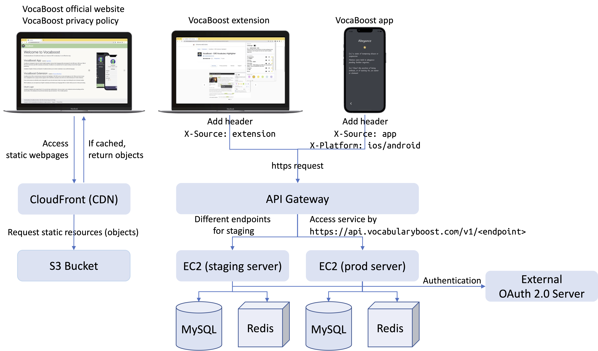
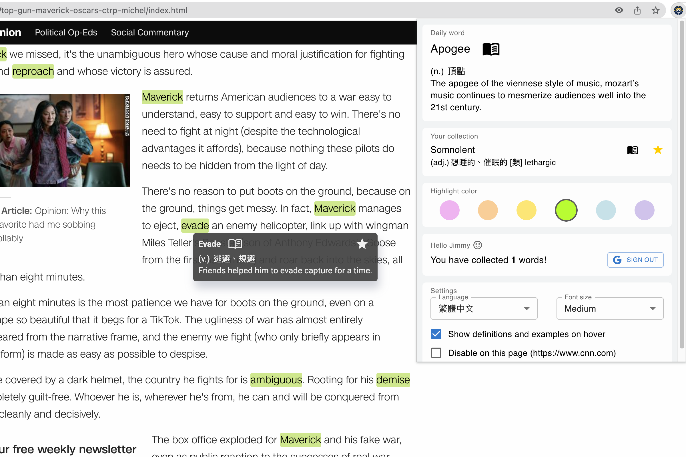
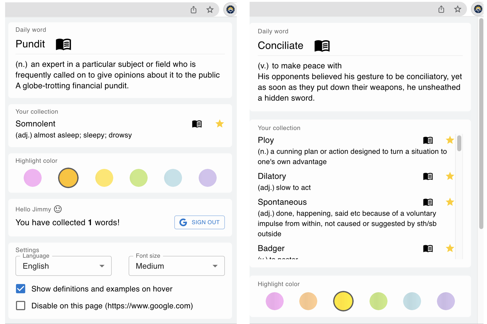

# VocaBoost - GRE Vocabulary Highlighter

View VocaBoost official website on [here](https://www.vocabularyboost.com/).

Install VocaBoost extension on [Chrome Web Store](https://chrome.google.com/webstore/detail/gre-vocabulary-highlighte/gfkmbmplhjdoejicgmaldndkcnnpplho).

Install VocaBoost app on [App Store](https://apps.apple.com/app/vocabboost/id6447704480).

VocaBoost is designed to help non-native English speakers improve their language skills and prepare for the GRE exam. With over 1500 of the most commonly used GRE vocabulary and phrases, VocaBoost is an essential tool for anyone looking to boost their English proficiency.

This browser extension that highlights 1500 GRE words on every web page you visit. When you hover mouse over a highlighted word, a popup window appears with its definition, examples, and a link to an online dictionary for further reference.

If you come across an unfamiliar word, simply add it to your list and review it later on our app or by clicking the icon in browser toolbar.

### Features

* Integrate with external Oauth services to perform authentication

* Once you login, your collected words and settings will be synchronized with the app and store in the database

* Add/remove words from collection by clicking the icon, and review word list by clicking the extension's icon in the browser toolbar or on mobile app

* Change the highlight color, the popup window's font size, and the language of the dictionary by clicking the extension icon on the toolbar

## System Architecture

## Demo

